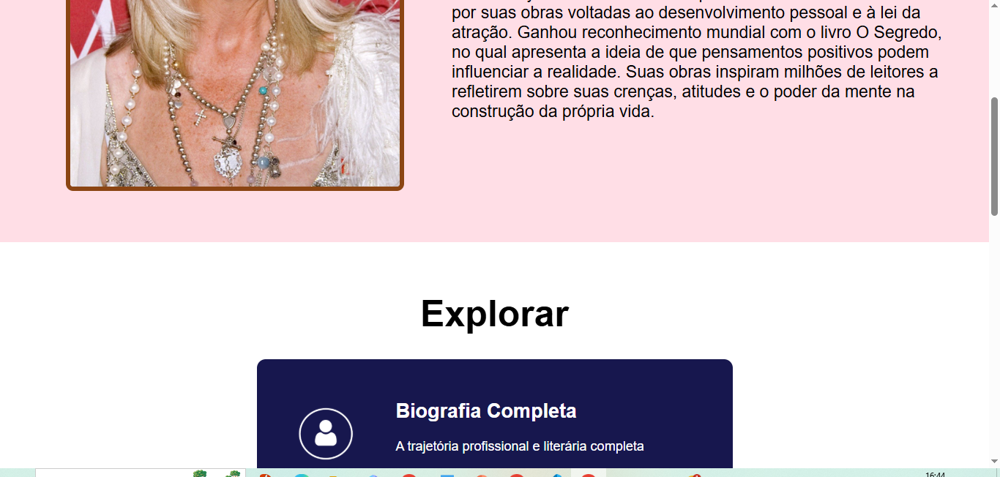
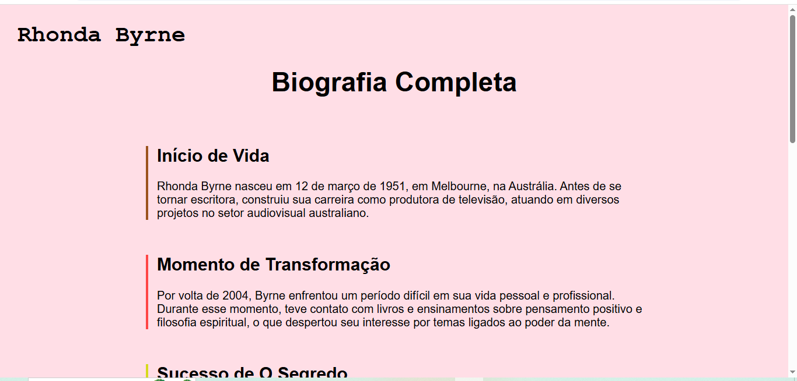

# Trabalho Prático - Semana 11

Nesta atividade, vamos dar continuidade ao projeto desenvolvido ao longo deste semestre, acrescentando a página de detalhes da aplicação.

Imagine que a página principal (home-page) mostre uma visão dos vários itens que existem no seu site. Ao clicar em um item, você é direcionado para a página de detalhes. A página de detalhes vai mostrar todas as informações sobre o item do seu projeto, seja esse item uma notícia, filme, receita, lugar turístico ou evento.

## Informações Gerais

- Nome: Victor Fernandes dos Santos
- Matrícula: 928768
- Descreva brevemente seu projeto: Site dedicado à autora de um dos livros mais impactantes que já li, ela se chama Rhonda Byrne e o livro é The Secret - O Segredo.

## Prints do trabalho





## Dados em JSON
Inclua abaixo a estrutura de dados definida para o seu projeto, apresentando pelo menos dois exemplos de registros em formato JSON.

```json
const explorar = [

  {
    id: 1,
    titulo: "Biografia Completa",
    descricao:
      "A trajetória profissional e literária completa",
    botao:
      "Ler mais →",
    classe:
      "biografia",
    icone:
      "img/personagem.png"
  },

  {
    id: 2,
    titulo: "Obras em Destaque",
    descricao:
      "Conheça os livros mais aclamados e premiados",
    botao:
      "Ver obras →",
    classe:
      "obras",
    icone:
      "img/obra.png"
  },

  {
    id: 3,
    titulo: "História de Vida",
    descricao:
      "A jornada pessoal que inspirou suas obras",
    botao:
      "Descobrir →",
    classe:
      "historia",
    icone:
      "img/historia.png"
  },

  {
    id: 4,
    titulo: "Frases Marcantes",
    descricao:
      "Citações e pensamentos que marcaram gerações",
    botao:
      "Explorar →",
    classe:
      "frases",
    icone:
      "img/aspas.png"
  }

];
```


